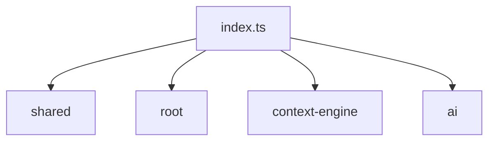

# Architecture: cli

## Overview

- 5 source files scanned
- 10,473 bytes of source code
- Languages: .json (2 files), .md (2 files), .ts (1 files)
- Entry points: src/index.ts

## Module Map

| Module | Files | Symbols | Imported By |
|--------|-------|---------|-------------|
| `root` | 4 files | 0 symbols | none |
| `index.ts` | 1 files | 3 symbols | none |

## Key Symbols

| Symbol | Location | Imported By |
|--------|----------|-------------|
| `function` `runScan` | src/index.ts:19 | 0 |
| `function` `runTrace` | src/index.ts:68 | 0 |
| `function` `runDiff` | src/index.ts:94 | 0 |

## Dependency Graph

